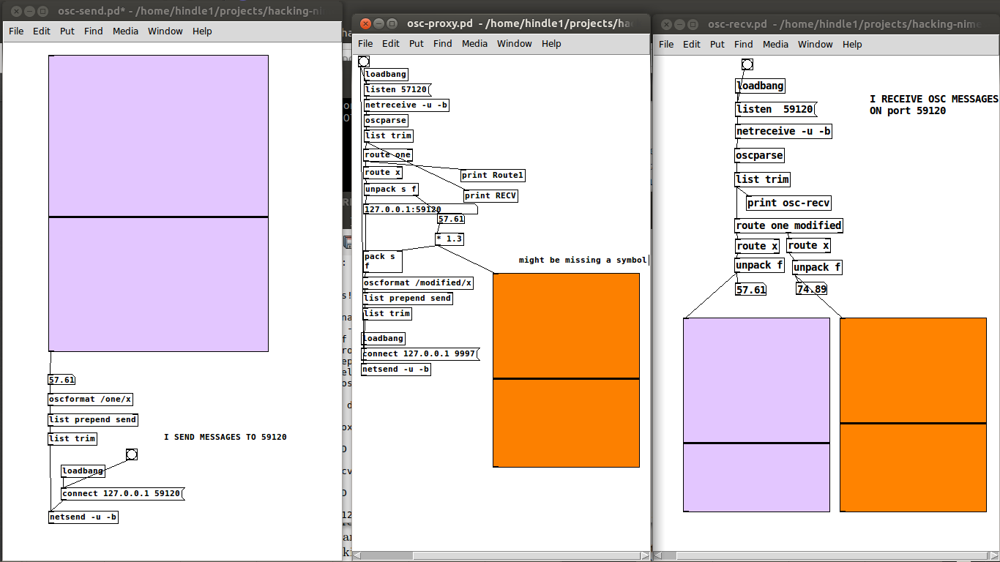

# HACKING NIMES

Paper: http://softwareprocess.es/pubs/hindle2016NIME-hacking-nimes.pdf

# Abstract

NIMEs  typically  focus  on  novelty  but  the  cost  of  novelty
is  often  to  ignore  other  non-functional  requirements  and
concerns such as usability or security.  Digital security has
probably not been a concern for performers due to the du-
ration of their performances and lack of disrespectful hack-
ers,  known as crackers,  in attendance carrying the appro-
priate equipment and software necessary to hack a perfor-
mance.   Yet  many  modern  NIMEs  could  be  hacked  from
smart-phones in the audience.  The lack of security harden-
ing makes NIMEs an easy target --- but a question arises:
if hacking can interrupt or modify a performance couldn't
hacking itself also be performance? Thus would music hack-
ing, live-hacking, be similar to live-coding?  In this paper we
discuss how NIMEs are in danger of being hacked, and yet
how hacking can be an act of performance too.

# Installation Dependencies

apt-get:

* python-dpkt
* python-pcapy
* python-scapy

    apt-get install  python-dpkt  python-pcapy python-scapy

Pip install python-osc

    pip install python-osc

PD or supercollider recommended

## chorus.py

    usage: chorus.py [-h] [--if INTERFACE] [--proto PROTO] [--repeat REPEAT]
                     [--delay DELAY] [--nospoof]
    
    Chorus!
    
    optional arguments:
      -h, --help       show this help message and exit
      --if INTERFACE   Interface
      --proto PROTO    Protocol
      --repeat REPEAT  Repeats
      --delay DELAY    Delay
      --nospoof

chorus.py duplicates packets on an interface

## osc-proxy.pd

Example PD proxy manipulation example 

## osc-recv.pd

Example PD OSC receiver

## osc-send.pd

Example PD OSC Sender

## piano.sc

Supercollider example 

## proxy.py

## sender.py

Utility OSC sender

     usage: sender.py [-h] [--host HOST] [--path PATH] [--port PORT] [N [N ...]]
     
     Chorus!
     
     positional arguments:
       N            data
     
     optional arguments:
       -h, --help   show this help message and exit
       --host HOST  Hostname
       --path PATH  Hostname
       --port PORT  Port

## watch.py

Utility to watch OSC packets

    usage: watch.py [-h] [--if INTERFACE] [--proto PROTO] [--nospoof]
    
    Watch!
    
    optional arguments:
      -h, --help      show this help message and exit
      --if INTERFACE  Interface
      --proto PROTO   Protocol
      --nospoof

## cap.py

Packet Capture Example

### oscbuilder.py

Library to build OSC Packets

### resenders.py

Library for resending packets

### roundtrip.pd

PD example of sending messages round trip without mrpeach
